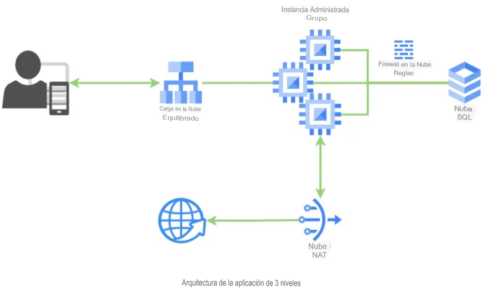

# Three Tier App (TFG Ruben) 

El proyecto implementa una aplicación Flask de muestra en GCP con la integración de diferentes 
servicios de Google Cloud como GCE, Cloud SQL, balanceador de carga y Cloud NAT.
Aquí están los archivos necesarios para la página web que se mostrará y el acceso a la BD.

Los servicios que se utilizan
1. VM Setup
1. Nat configuration
1. Code integration
1. Loadbalancer Setup
1. Cloud SQL Integration
1. VPC Network settings
